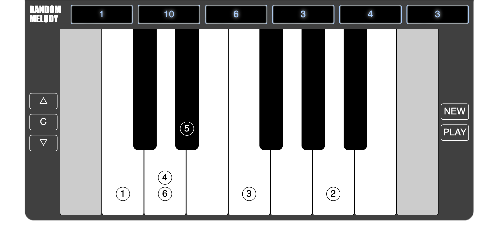

# Random Melody Challenge

\[[Check out the live version!](https://random-melody.temochka.com/)\]

- Tap 'NEW' to produce a unique 6-note sequence.
- Craft a composition using this sequence, keeping the original note order. Feel free to:
    - Shift the entire sequence by any number of semitones.
    - Change any note's octave.
    - Experiment with different note durations.
    - If stuck, alter one note by a semitone.
